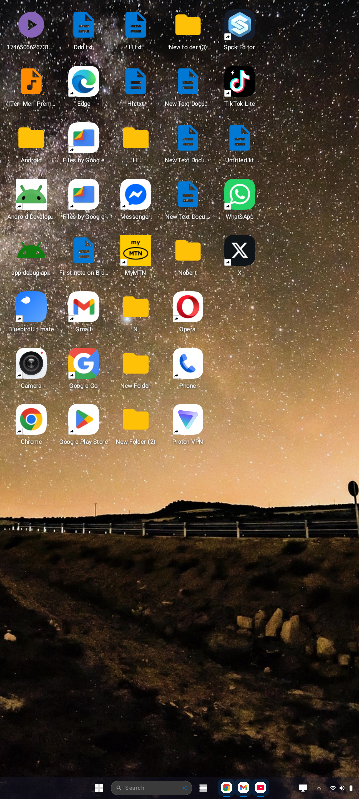
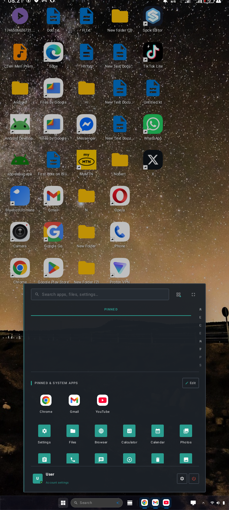
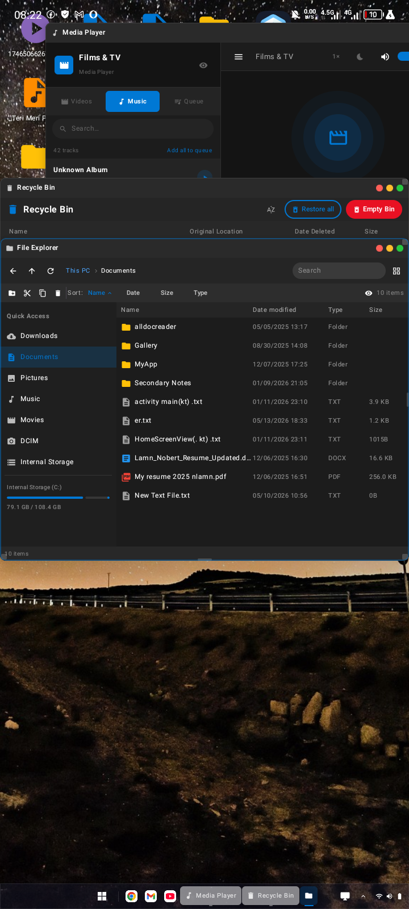

<div align="center">

# 🐦 Bluebird

### A full Windows 11 desktop experience — on Android.

[](https://android.com)
[](https://kotlinlang.org)
[](https://developer.android.com/jetpack/compose)
[-orange?style=flat-square)](https://developer.android.com/studio/releases/platforms)
[](LICENSE)
[](https://github.com/norbert-web/bluebird/releases)
[](https://github.com/norbert-web/bluebird/actions)

<br/>

> **Bluebird** is an open-source Android home screen replacement that recreates the Windows 11 desktop environment pixel-perfectly — complete with a floating windowed app system, real file explorer, and live notifications.

<br/>

**[📦 Download APK](#-download--releases) · [📸 Screenshots](#-screenshots) · [✨ Features](#-features) · [🏗️ Architecture](#-architecture) · [🚀 Getting Started](#-getting-started)**

</div>

---

## 📋 Table of Contents

- [Overview](#-overview)
- [Screenshots](#-screenshots)
- [Features](#-features)
- [Built-in Apps](#-built-in-apps)
- [Architecture](#-architecture)
- [Tech Stack](#-tech-stack)
- [Project Structure](#-project-structure)
- [Permissions](#-permissions)
- [Getting Started](#-getting-started)
- [Building from Source](#-building-from-source)
- [Download & Releases](#-download--releases)
- [Configuration](#-configuration)
- [Known Limitations](#-known-limitations)
- [Roadmap](#-roadmap)
- [Contributing](#-contributing)
- [License](#-license)
- [Credits](#-credits)

---

## 🔭 Overview

**Bluebird** transforms your Android device into a Windows 11 desktop. It is a fully functional **home screen launcher** — set it as your default launcher and your phone becomes a PC-style productivity device.

- A **floating windowed app system** where every app opens in a draggable, resizable window
- A **real Windows 11 taskbar** with clock, pinned apps, system tray, and Action Center
- A **Start Menu** with app grid, search, user profile, and power options
- A **real file explorer** powered by Android's `File` API — not simulated
- **Live system notifications** via `NotificationListenerService`
- **Real phone dialer** and **SMS messaging** using Android's native contact & telephony APIs
- A **media player** with full playback controls powered by `MediaPlayer`
- An **image viewer** with pinch-to-zoom, swipe navigation, and wallpaper-set support
- A **Recycle Bin** — deleted files go here, restorable or permanently removed
- A first-launch **OOBE wizard** (Out-of-Box Experience) for permissions, username, and avatar
- **Persistent wallpapers** (home + lock screen) that survive restarts
- **Desktop shortcuts** — pin any file, folder, or app directly to the desktop

Built entirely with **Jetpack Compose** and **Kotlin**, targeting Android 8.0+ (API 26+).

---

## 📸 Screenshots

<p align="center">
  
  
  
</p>

<p align="center">
  <b>Desktop</b> • <b>Start Menu</b> • <b>File Explorer</b>
</p>

---

## ✨ Features

### 🖥️ Desktop Environment

| Feature | Description |
|---------|-------------|
| **Floating Windows** | Every app opens in a draggable, focusable window with minimize/maximize/close |
| **Acrylic Glassmorphism UI** | Frosted-glass panels with blur, transparency, and layered depth |
| **Multi-window management** | Stack and switch between multiple open windows |
| **Snap layout picker** | Windows 11–style snap layout overlay for quick window positioning |
| **Desktop icons** | System icons (This PC, Recycle Bin, Settings, Network), file shortcuts, and app shortcuts |
| **Right-click context menu** | Long-press desktop → New Folder, New Text File, Personalize, Refresh, Display Settings |
| **Desktop shortcuts** | Drag any file from File Explorer → Create Shortcut; long-press app in Start Menu → Add to Desktop |
| **Scrollable desktop** | Desktop scrolls when icons exceed the screen area |
| **5 built-in wallpapers** | Blue Bloom, Sunset Purple, Forest Green, Deep Space, Aurora — gradient themes |
| **Custom wallpaper** | Pick any image from Gallery for home screen and lock screen separately |
| **Wallpaper persistence** | Custom images copied to internal storage — survive app restarts and reboots |
| **Double-tap taskbar toggle** | Double-tap the desktop to hide/show the taskbar (full immersive mode) |
| **Dark / Light theme** | Full dark and light mode switching, live and persistent |

### 📌 Taskbar

| Feature | Description |
|---------|-------------|
| **Windows 11 taskbar** | Centered Start button, pinned apps, running window indicators, system tray |
| **Pin to taskbar** | Long-press any app icon in Start Menu → Pin to taskbar |
| **Unpin from taskbar** | Long-press any pinned taskbar icon → Unpin |
| **Running window badges** | Dot indicator below any app with an open window |
| **Window switcher** | Tap a running window's taskbar icon to focus or restore it |
| **System tray** | Battery level, Wi-Fi indicator, Bluetooth, clock, date |
| **Notification badge** | Badge count on Action Center button when there are unread notifications |

### 🪟 Start Menu

| Feature | Description |
|---------|-------------|
| **App grid** | Pinned apps + all built-in apps in a 6-column icon grid |
| **All Apps view** | Scroll through every installed app on the device |
| **Real-time search** | Type to filter installed apps instantly |
| **User profile** | Real username + avatar (from OOBE setup) shown in bottom bar |
| **App context menu** | Long-press any app → Open / Add to Desktop / Pin to Taskbar |
| **Power menu** | Sleep, Lock, Restart, Shut Down options |

### 🗂️ File Explorer (Real Filesystem)

| Feature | Description |
|---------|-------------|
| **True filesystem browsing** | Uses Android `File` API — real files, real sizes, real dates |
| **Breadcrumb navigation** | Clickable path segments — tap any segment to jump there |
| **List & Grid views** | Toggle between detail list and thumbnail grid |
| **Sort options** | Sort by Name, Date, Size, or Type — ascending or descending |
| **Hidden files toggle** | Show/hide dotfiles |
| **File search** | Filter files in the current directory by name |
| **File operations** | Copy, Cut, Paste, Rename, Delete (to Recycle Bin) |
| **File context menu** | Long-press → Open / Copy / Cut / Rename / Create Shortcut / Delete |
| **Create desktop shortcut** | Right-click any file/folder → Create Desktop Shortcut |
| **New folder** | Create folders directly in current directory |
| **Open with intent** | Tapping a file opens it with the correct system app |
| **Quick Access panel** | Desktop, Downloads, Documents, Pictures, Music, Movies, DCIM, Storage |
| **Storage progress bar** | Shows used/free internal storage in left panel |
| **File type icons** | Distinct color-coded icons for images, video, audio, PDF, text, archives, APKs |

### 🖼️ Image Viewer

| Feature | Description |
|---------|-------------|
| **Full-screen viewer** | Opens any image in immersive full-screen mode |
| **Pinch-to-zoom** | Multi-touch pinch zoom, pan, double-tap to zoom 2.5× |
| **Swipe navigation** | Swipe left/right to move between images in the same folder |
| **Thumbnail strip** | Scrollable thumbnail row at the bottom for quick jump |
| **Rotate** | Rotate image 90° CW or CCW |
| **Share** | Share image via system share sheet |
| **Set as wallpaper** | Set current image as home screen wallpaper instantly |
| **Delete to bin** | Delete to Recycle Bin from inside the viewer |
| **Image info panel** | File name, size, date modified, path |

### 🎵 Media Player

| Feature | Description |
|---------|-------------|
| **Audio playback** | Plays MP3, WAV, OGG, FLAC, AAC, M4A via Android `MediaPlayer` |
| **Video support** | MP4, MKV, AVI, MOV, WebM |
| **Auto-playlist** | Loads all media files from the same folder into a playlist |
| **Seek bar** | Real-time playback position with tap-to-seek |
| **Track metadata** | Title, artist, album from file tags via `MediaMetadataRetriever` |
| **Playback controls** | Play/Pause, Previous, Next, Shuffle, Repeat (Off / All / One) |
| **Playlist panel** | Left sidebar with all tracks, now-playing indicator, equalizer animation |
| **Duration display** | Track duration and current position always visible |

### 📱 Phone

| Feature | Description |
|---------|-------------|
| **Real contacts** | Reads contacts from `ContactsContract` — real names and numbers |
| **Call log** | Reads last 100 calls from `CallLog` with incoming/outgoing/missed indicators |
| **Numeric keypad** | Full dial pad that triggers `ACTION_CALL` intent |
| **Contact search** | Search by name or number |
| **One-tap call** | Tap any contact or call log entry to dial |

### 💬 Messages (SMS)

| Feature | Description |
|---------|-------------|
| **Real SMS threads** | Reads conversation threads from `Telephony.Sms.Conversations` |
| **Message view** | Full conversation with sent/received bubbles |
| **Send SMS** | Compose and send messages via `ACTION_SENDTO` intent |
| **Contact resolution** | Phone numbers resolved to contact names automatically |
| **New message** | Start a new conversation with any number |
| **Conversation search** | Filter threads by name or message content |

### 🗑️ Recycle Bin

| Feature | Description |
|---------|-------------|
| **System Recycle Bin** | All files deleted from File Explorer go here |
| **Badge count** | Desktop Recycle Bin icon shows item count badge |
| **Restore** | Restore items to their original paths |
| **Permanent delete** | Remove items permanently one by one |
| **Empty bin** | Delete all items at once with confirmation |
| **Multi-select** | Checkbox multi-select for bulk operations |
| **Item details** | Original path, deletion date, file size for every item |

### ⚙️ Settings

| Section | Features |
|---------|---------|
| **Personalization** | Wallpaper picker (home + lock screen), gradient presets, accent color (8 colors), dark/light mode |
| **Display** | Brightness slider → real `Settings.System.SCREEN_BRIGHTNESS` |
| **Sound** | Volume slider → real `AudioManager.STREAM_MUSIC` |
| **Network** | Wi-Fi toggle → opens system Wi-Fi settings; Bluetooth → opens system Bluetooth settings |
| **Battery** | Real battery level + charging status with progress bar |
| **Storage** | Real used/free storage with progress bar |
| **Apps** | List of all installed apps; tap to open App Info |
| **Accounts** | User profile with avatar and name from OOBE |
| **About** | Device model, manufacturer, Android version, API level, RAM, app version |

### 🔔 Notifications

| Feature | Description |
|---------|-------------|
| **Live notifications** | `NotificationListenerService` reads real system notifications |
| **Action Center** | Grouped notifications with app name, title, body, and timestamp |
| **Dismiss** | Dismiss individual notifications or clear all |
| **Auto-reconnect** | Service callbacks re-registered on every `onResume()` |

### 🔐 First-Launch Setup (OOBE)

| Step | Description |
|------|-------------|
| **Welcome** | Animated welcome screen with Bluebird branding |
| **Permissions** | Per-permission grant buttons for Storage, Contacts, SMS, Camera, Notifications |
| **Username** | Enter your name — shown in Start Menu, Lock Screen, and Settings |
| **Profile picture** | Pick from Gallery — stored persistently in internal storage |
| **Skip support** | Every step can be skipped and revisited in Settings later |

### 🔒 Lock Screen

| Feature | Description |
|---------|-------------|
| **Custom wallpaper** | Shows lock screen wallpaper (separate from home wallpaper) |
| **Live clock** | Large 12-hour clock with date |
| **User avatar** | Profile picture or initial letter shown on lock screen |
| **Tap to unlock** | Single tap unlocks back to the desktop |

---

## 📱 Built-in Apps

| App | Icon | Description |
|-----|------|-------------|
| **File Explorer** | 📁 | Real filesystem browser |
| **Settings** | ⚙️ | Full settings panel |
| **Phone** | 📞 | Real dialer with contacts & call log |
| **Messages** | 💬 | Real SMS reader and sender |
| **Media Player** | 🎵 | Audio/video player with playlist |
| **Image Viewer** | 🖼️ | Full-screen image viewer |
| **Recycle Bin** | 🗑️ | Deleted files manager |
| **Browser** | 🌐 | WebView-based browser |
| **Calculator** | 🔢 | Standard calculator |
| **Calendar** | 📅 | Month calendar view |
| **Photos** | 🖼️ | Photo gallery |
| **Task Manager** | 📊 | Running processes viewer |
| **Text Editor** | 📝 | In-launcher editor with syntax highlighting |

---

## 🏗️ Architecture

Bluebird uses a single-ViewModel, unidirectional data flow architecture:

```
┌─────────────────────────────────────────────────────────────┐
│                        MainActivity                         │
│  ┌─────────────────────┐    ┌─────────────────────────────┐ │
│  │   SetupScreen       │    │      DesktopScreen          │ │
│  │   (OOBE Wizard)     │    │                             │ │
│  └─────────────────────┘    │  ┌──────────┐ ┌─────────┐  │ │
│                             │  │ Desktop  │ │ Windows │  │ │
│                             │  │ (Icons,  │ │ Manager │  │ │
│                             │  │ Wallpaper│ │         │  │ │
│                             │  │ Context  │ │ Floating│  │ │
│                             │  │ Menu)    │ │ Windows │  │ │
│                             │  └──────────┘ └─────────┘  │ │
│                             │  ┌──────────────────────┐   │ │
│                             │  │      Taskbar          │   │ │
│                             │  │  Start │ Apps │ Tray  │   │ │
│                             │  └──────────────────────┘   │ │
│                             │  ┌──────────────────────┐   │ │
│                             │  │  Overlays (animated)  │   │ │
│                             │  │  Start Menu │ Search  │   │ │
│                             │  │  Action Center│ Power  │   │ │
│                             │  └──────────────────────┘   │ │
│                             └─────────────────────────────┘ │
└─────────────────────────────────────────────────────────────┘
                               │
                    ┌──────────▼──────────┐
                    │  LauncherViewModel   │
                    │                      │
                    │  LauncherUiState     │
                    │  ┌─────────────────┐ │
                    │  │ wallpaper       │ │
                    │  │ userProfile     │ │
                    │  │ installedApps   │ │
                    │  │ pinnedApps      │ │
                    │  │ openWindows     │ │
                    │  │ notifications   │ │
                    │  │ desktopShortcuts│ │
                    │  │ recycleBinItems │ │
                    │  │ overlayStates   │ │
                    │  └─────────────────┘ │
                    └──────────┬──────────┘
                               │
               ┌───────────────┼───────────────┐
               │               │               │
     ┌─────────▼──────┐  ┌─────▼──────┐  ┌────▼────────┐
     │  SharedPrefs   │  │ Android    │  │ System      │
     │  (persistence) │  │ APIs       │  │ Services    │
     │                │  │ File, SMS  │  │ Wallpaper   │
     │  - wallpaper   │  │ Contacts   │  │ AudioManager│
     │  - username    │  │ CallLog    │  │ Notification│
     │  - pinned apps │  │ PackageMgr │  │ Listener    │
     │  - shortcuts   │  │ MediaPlayer│  │ BatteryMgr  │
     │  - recycle bin │  └────────────┘  └─────────────┘
     └────────────────┘
```

### Data Flow

```
User Gesture → Composable → ViewModel.action() → UiState update → Recompose
```

All state lives in a single `LauncherUiState` data class, collected as `StateFlow` by Compose. No Room database — all persistence is through `SharedPreferences` with Gson serialization for complex objects.

---

## 🛠️ Tech Stack

| Category | Technology | Version |
|----------|-----------|---------|
| **Language** | Kotlin | 2.0.0 |
| **UI Framework** | Jetpack Compose | BOM 2024.08.00 |
| **Architecture** | MVVM + StateFlow | — |
| **Build System** | Gradle (KTS) | 8.5.2 |
| **Navigation** | None (custom window manager) | — |
| **Image Loading** | Coil | 2.7.0 |
| **JSON** | Gson | 2.11.0 |
| **Persistence** | SharedPreferences + DataStore | 1.1.1 |
| **Icons** | Material Icons Extended | BOM |
| **System UI** | Accompanist SystemUI | 0.34.0 |
| **Permissions** | Accompanist Permissions | 0.34.0 |
| **Drawable Rendering** | Accompanist DrawablePainter | 0.34.0 |
| **Splash Screen** | AndroidX Core SplashScreen | 1.0.1 |
| **Min SDK** | Android 8.0 (Oreo) | API 26 |
| **Target SDK** | Android 15 | API 35 |
| **Compile SDK** | 35 | — |
| **Java Version** | 17 | — |

---

## 📁 Project Structure

```
Bluebird/
├── app/
│   ├── build.gradle.kts
│   ├── proguard-rules.pro
│   └── src/main/
│       ├── AndroidManifest.xml
│       └── java/com/bluebird/
│           ├── BluebirdApplication.kt
│           ├── DesktopModeHelper.kt
│           ├── LauncherApplication.kt
│           ├── LauncherViewModel.kt          # Core logic (~92KB) — all state & business logic
│           ├── MainActivity.kt               # Entry point, OOBE routing, immersive mode
│           │
│           ├── browser/
│           │   ├── data/
│           │   │   └── BrowserRepository.kt
│           │   ├── ui/
│           │   │   ├── BrowserScreen.kt
│           │   │   ├── NewTabPage.kt
│           │   │   ├── components/
│           │   │   │   ├── Dialogs.kt
│           │   │   │   └── NavigationComponents.kt
│           │   │   ├── keyboard/
│           │   │   │   └── FloatingKeyboard.kt
│           │   │   ├── model/
│           │   │   │   └── Models.kt
│           │   │   ├── panels/
│           │   │   │   └── Panels.kt
│           │   │   └── webview/
│           │   │       └── BrowserWebView.kt
│           │   └── utils/
│           │       ├── AdBlocker.kt
│           │       ├── DownloadHelper.kt
│           │       ├── UrlUtils.kt
│           │       └── UserAgents.kt
│           │
│           ├── data/
│           │   ├── BootReceiver.kt           # Auto-launch on device boot
│           │   └── NotificationListener.kt   # NotificationListenerService
│           │
│           ├── editor/
│           │   ├── core/
│           │   │   ├── EditorModels.kt
│           │   │   └── PremiumEditorState.kt
│           │   ├── editor/actions/
│           │   │   └── TextActions.kt
│           │   ├── highlighting/
│           │   │   └── SyntaxEngine.kt       # Syntax/code highlighting engine
│           │   ├── ui/
│           │   │   ├── components/
│           │   │   │   └── EditorComponents.kt
│           │   │   ├── screens/
│           │   │   │   └── PremiumTextEditorScreen.kt
│           │   │   └── theme/
│           │   │       └── EditorThemes.kt
│           │   └── utils/
│           │       └── EditorPreferences.kt
│           │
│           ├── ui/
│           │   ├── components/
│           │   │   ├── ActionCenter.kt       # Notification panel + quick tiles
│           │   │   ├── CommonComponents.kt   # AcrylicSurface, AppIconSmall, shared UI
│           │   │   ├── Desktop.kt            # Wallpaper, icons, context menu (~104KB)
│           │   │   ├── DesktopPreferences.kt
│           │   │   ├── DesktopWallpaperState.kt
│           │   │   ├── SearchOverlay.kt      # Global search overlay
│           │   │   ├── StartMenu.kt          # Start menu, app grid, power menu (~98.6KB)
│           │   │   ├── Taskbar.kt            # Bluebird taskbar, tray, clock (~75.3KB)
│           │   │   ├── WidgetsPanel.kt       # Widgets slide-in panel
│           │   │   └── WindowManager.kt      # Floating window container & routing
│           │   ├── screens/
│           │   │   ├── AppScreens.kt         # Calculator, Calendar, Photos, TaskManager
│           │   │   ├── BrowserScreen.kt      # WebView browser (legacy screen)
│           │   │   ├── DesktopScreen.kt      # Root desktop compositor
│           │   │   ├── FileExplorerScreen.kt # Real file manager
│           │   │   ├── ImageViewerScreen.kt  # Full-screen image viewer
│           │   │   ├── Launcherupdatesettings.kt # In-app update settings
│           │   │   ├── LockScreenActivity.kt # System lock screen activity
│           │   │   ├── MediaPlayerScreen.kt  # Audio/video player
│           │   │   ├── MessagesScreen.kt     # SMS reader/sender
│           │   │   ├── PhoneScreen.kt        # Dialer + contacts + call log
│           │   │   ├── RecycleBinScreen.kt   # Recycle bin manager
│           │   │   ├── SettingsScreen.kt     # Full settings (12 categories)
│           │   │   ├── SetupScreen.kt        # First-launch OOBE wizard
│           │   │   └── TextEditorScreen.kt   # In-launcher text/code editor
│           │   └── theme/
│           │       └── Theme.kt              # bluebirdColors, dark/light Material3 themes
│           │
│           └── update/
│               ├── UpdateManager.kt          # GitHub-based update checker & downloader
│               ├── UpdateNotificationHelper.kt
│               └── Updatemodels.kt
│
├── gradle/
│   ├── libs.versions.toml                    # Version catalog (all dependencies)
│   └── wrapper/
│       └── gradle-wrapper.properties
│
├── build.gradle.kts                          # Project-level build config
├── settings.gradle.kts                       # Module settings
├── gradle.properties                         # Gradle JVM args
├── CHANGELOG.md
├── CONTRIBUTING.md
├── LICENSE
├── SECURITY.md
└── README.md
```

---

## 🔐 Permissions

Bluebird requests the following permissions, each explained:

| Permission | Why it's needed | Required? |
|-----------|-----------------|-----------|
| `QUERY_ALL_PACKAGES` | List all installed apps in Start Menu | ✅ Yes |
| `RECEIVE_BOOT_COMPLETED` | Auto-start as home screen after reboot | ✅ Yes |
| `SET_WALLPAPER` / `SET_WALLPAPER_HINTS` | Apply custom wallpaper to system | ✅ Yes |
| `READ_MEDIA_IMAGES/VIDEO/AUDIO` | Browse media files in File Explorer | ✅ Yes |
| `READ_EXTERNAL_STORAGE` | Filesystem access (Android ≤ 12) | ✅ Yes |
| `MANAGE_EXTERNAL_STORAGE` | Full filesystem access for File Explorer | ⚠️ Optional |
| `READ_CONTACTS` | Show real contacts in Phone app | ⚠️ Optional |
| `CALL_PHONE` | Dial calls from the Phone dialer | ⚠️ Optional |
| `READ_CALL_LOG` | Show recent calls in Phone app | ⚠️ Optional |
| `READ_SMS` / `SEND_SMS` / `RECEIVE_SMS` | Read and send messages | ⚠️ Optional |
| `CAMERA` | Take profile picture during OOBE | ⚠️ Optional |
| `POST_NOTIFICATIONS` | Show system notifications | ⚠️ Optional |
| `BIND_NOTIFICATION_LISTENER_SERVICE` | Read live notifications via system service | ⚠️ Optional |
| `INTERNET` / `ACCESS_NETWORK_STATE` | Browser app, network status, update checker | ⚠️ Optional |
| `BLUETOOTH_CONNECT` / `BLUETOOTH_SCAN` | Bluetooth status in Quick Settings | ⚠️ Optional |
| `WRITE_SETTINGS` | Adjust screen brightness | ⚠️ Optional |
| `BATTERY_STATS` | Real battery level in status bar | ⚠️ Optional |

> ⚠️ `MANAGE_EXTERNAL_STORAGE` requires manual grant in Android Settings on API 30+. The OOBE wizard guides the user through this.

> ⚠️ **Notification Listener** must be manually granted in **Settings → Notifications → Notification Access**. The OOBE wizard opens this screen directly.

---

## 🚀 Getting Started

### Prerequisites

- Android Studio **Hedgehog (2023.1.1)** or newer
- JDK **17** or newer
- Android device or emulator running **Android 8.0+ (API 26+)**
- Gradle **8.5.2**

### Clone the Repository

```bash
git clone https://github.com/norbert-web/bluebird.git
cd io.github.norbertweb.bluebird
```

### Open in Android Studio

1. Open Android Studio
2. Click **File → Open** and select the `Bluebird/` folder
3. Wait for Gradle sync to complete
4. Connect your device or start an emulator

### Set as Default Launcher

After installing, Android will prompt you to select a default launcher. Choose **Bluebird** and tap **Always**. If not prompted:

1. Go to **Settings → Apps → Default Apps → Home App**
2. Select **Bluebird**

---

## 🔨 Building from Source

### Debug Build (for development)

```bash
./gradlew assembleDebug
```

Output: `app/build/outputs/apk/debug/app-debug.apk`

### Release Build

1. Create a keystore (first time only):

```bash
keytool -genkey -v -keystore io.github.norbertweb.bluebird-release.jks \
  -keyalg RSA -keysize 2048 -validity 10000 \
  -alias io.github.norbertweb.bluebird
```

2. Configure signing in `app/build.gradle.kts`:

```kotlin
android {
    signingConfigs {
        create("release") {
            storeFile = file("../io.github.norbertweb.bluebird-release.jks")
            storePassword = System.getenv("KEYSTORE_PASS")
            keyAlias = "io.github.norbertweb.bluebird"
            keyPassword = System.getenv("KEY_PASS")
        }
    }
    buildTypes {
        release {
            signingConfig = signingConfigs.getByName("release")
            isMinifyEnabled = true
            isShrinkResources = true
            proguardFiles(
                getDefaultProguardFile("proguard-android-optimize.txt"),
                "proguard-rules.pro"
            )
        }
    }
}
```

3. Build:

```bash
KEYSTORE_PASS=yourpassword KEY_PASS=yourkeypass ./gradlew assembleRelease
```

Output: `app/build/outputs/apk/release/app-release.apk`

### Install Directly to Device

```bash
# Debug
./gradlew installDebug

# Or use ADB manually
adb install -r app/build/outputs/apk/debug/app-debug.apk
```

### Run Tests

```bash
./gradlew test          # Unit tests
./gradlew connectedTest # Instrumented tests (requires device/emulator)
```

---

## 📦 Download & Releases

### Latest Release: v1.6.0

**[⬇️ Download from GitHub Releases →](https://github.com/norbert-web/bluebird/releases/latest)**

### Installing the APK

1. Download the latest `bluebird-release.apk` from [GitHub Releases](https://github.com/norbert-web/bluebird/releases/latest)
2. On your Android device, go to **Settings → Security → Install unknown apps**
3. Enable **Allow from this source** for your browser or file manager
4. Open the downloaded APK and tap **Install**
5. When prompted to choose a launcher, select **Bluebird → Always**

### Sideload via ADB

```bash
adb install io.github.norbertweb.bluebird-release.apk
```

---

## ⚙️ Configuration

Bluebird stores all user preferences in `SharedPreferences` under the key `launcher_prefs_v2`. There is no config file — everything is configured through the in-app **Settings** and **OOBE wizard**.

### Resetting to defaults

To fully reset Bluebird:

```bash
adb shell pm clear io.github.norbertweb.bluebirdb.norbertweb.bluebird
```

Or: **Android Settings → Apps → Bluebird → Storage → Clear Data**

### Changing the package name

If you want to publish your own fork, change the package name in:

1. `app/build.gradle.kts` → `namespace` and `applicationId`
2. `app/src/main/AndroidManifest.xml` → `android:authorities` in the `FileProvider`
3. Rename the Java package directory from `com/bluebird/` to your new package

---

## ⚠️ Known Limitations

| Limitation | Reason | Workaround |
|-----------|--------|-----------|
| **Wi-Fi cannot be toggled programmatically** | Removed in Android 10 (API 29) by Google | Tapping Wi-Fi opens system Wi-Fi Settings |
| **Bluetooth toggle** | Deprecated for third-party apps in Android 13 | Tapping opens system Bluetooth Settings |
| **MANAGE_EXTERNAL_STORAGE** | Requires manual grant on Android 11+ | OOBE wizard provides a direct link |
| **Notification Listener** | Requires manual grant in system settings | OOBE wizard opens the settings screen |
| **File deletions are permanent** | Recycle Bin tracks metadata but `File.delete()` can't be reliably undone on all devices | Items appear in Recycle Bin with restore option |
| **Screen brightness control** | Requires `WRITE_SETTINGS` which must be granted manually | Settings → Display → System permissions |
| **Wallpaper on lock screen** | Android system lock screen is separate from the in-app lock screen | Use the in-app lock (Start → Power → Lock) for Bluebird's lock screen |

---

## 🗺️ Roadmap

### Upcoming
- [ ] Resizable floating windows (drag handles on edges/corners)
- [ ] Remote Schools built-in learning app (Uganda curriculum P1–S6)
- [ ] Taskbar auto-hide mode (hover to reveal)
- [ ] Multiple virtual desktops
- [ ] Window transparency controls

### Future
- [ ] Widget support (third-party app widgets on desktop)
- [ ] Clipboard manager
- [ ] Screen recording
- [ ] Keyboard shortcuts (for physical keyboards)
- [ ] Custom accent color picker (full color wheel)
- [ ] Cloud sync for settings and shortcuts
- [ ] Theming engine (custom themes beyond dark/light)

---

## 🤝 Contributing

Contributions are warmly welcome! Here's how to get started:

### Bug Reports

Use the [GitHub Issues](https://github.com/norbert-web/bluebird/issues) tracker. Please include:

- Android version and device model
- Steps to reproduce
- Expected vs actual behavior
- Logcat output (filter by `io.github.norbertweb.bluebird`)

### Pull Requests

1. **Fork** the repository
2. **Create a branch**: `git checkout -b feature/your-feature-name`
3. **Make your changes** following the existing code style
4. **Test** on a real device (emulators may not support all launcher features)
5. **Commit** with a clear message: `git commit -m "feat: add window resize handles"`
6. **Push** and open a Pull Request

### Code Style

- Follow [Kotlin coding conventions](https://kotlinlang.org/docs/coding-conventions.html)
- Use Jetpack Compose best practices (hoisted state, stable parameters)
- Keep Composables small and focused
- Add `@Preview` annotations where useful
- State mutations must go through `LauncherViewModel` — never mutate state directly in a composable

### Branching Strategy

| Branch | Purpose |
|--------|---------|
| `main` | Stable, released code |
| `develop` | Integration branch for next release |
| `feature/*` | New features |
| `fix/*` | Bug fixes |
| `release/*` | Release preparation |

---

## 📜 License

```
MIT License

Copyright (c) 2025 Bluebird Contributors

Permission is hereby granted, free of charge, to any person obtaining a copy
of this software and associated documentation files (the "Software"), to deal
in the Software without restriction, including without limitation the rights
to use, copy, modify, merge, publish, distribute, sublicense, and/or sell
copies of the Software, and to permit persons to whom the Software is
furnished to do so, subject to the following conditions:

The above copyright notice and this permission notice shall be included in all
copies or substantial portions of the Software.

THE SOFTWARE IS PROVIDED "AS IS", WITHOUT WARRANTY OF ANY KIND, EXPRESS OR
IMPLIED, INCLUDING BUT NOT LIMITED TO THE WARRANTIES OF MERCHANTABILITY,
FITNESS FOR A PARTICULAR PURPOSE AND NONINFRINGEMENT. IN NO EVENT SHALL THE
AUTHORS OR COPYRIGHT HOLDERS BE LIABLE FOR ANY CLAIM, DAMAGES OR OTHER
LIABILITY, WHETHER IN AN ACTION OF CONTRACT, TORT OR OTHERWISE, ARISING FROM,
OUT OF OR IN CONNECTION WITH THE SOFTWARE OR THE USE OR OTHER DEALINGS IN THE
SOFTWARE.
```

---

## 🙏 Credits

### Libraries Used

| Library | License | Purpose |
|---------|---------|---------|
| [Jetpack Compose](https://developer.android.com/jetpack/compose) | Apache 2.0 | UI framework |
| [Coil](https://coil-kt.github.io/coil/) | Apache 2.0 | Image loading |
| [Gson](https://github.com/google/gson) | Apache 2.0 | JSON serialization |
| [Accompanist](https://google.github.io/accompanist/) | Apache 2.0 | System UI, permissions, painter |
| [Material Icons Extended](https://fonts.google.com/icons) | Apache 2.0 | Icon set |
| [AndroidX DataStore](https://developer.android.com/jetpack/androidx/releases/datastore) | Apache 2.0 | Preferences persistence |
| [AndroidX SplashScreen](https://developer.android.com/develop/ui/views/launch/splash-screen) | Apache 2.0 | Splash screen API |

### Design Inspiration

- [Windows 11](https://www.microsoft.com/en-us/windows/windows-11) by Microsoft — for the UI design language, Fluent Design system, and Acrylic material

### Contributors

<a href="https://github.com/norbert-web/bluebird/graphs/contributors">
  
</a>

---

## 📬 Contact

- **GitHub Issues**: [github.com/norbert-web/bluebird/issues](https://github.com/norbert-web/bluebird/issues)
- **Discussions**: [github.com/norbert-web/bluebird/discussions](https://github.com/norbert-web/bluebird/discussions)
- **Email**: trebronwayne@gmail.com

---

<div align="center">

Made with 🫡💪💗 and Kotlin · [⬆️ Back to top](#-bluebird)

</div>
